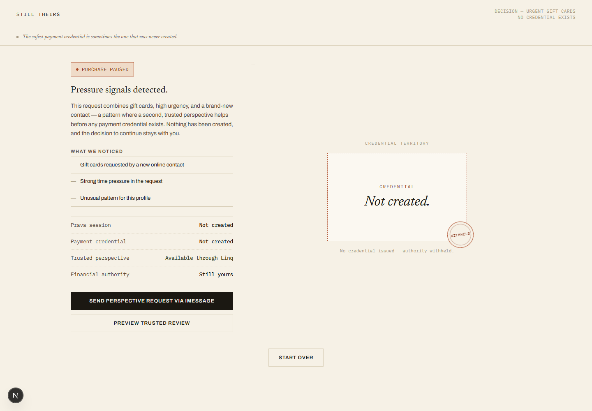
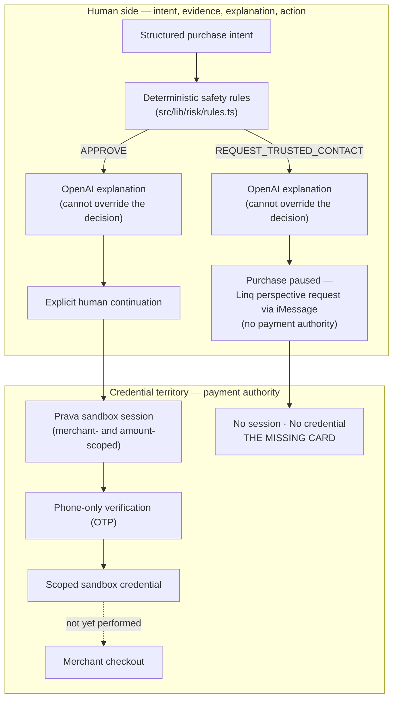
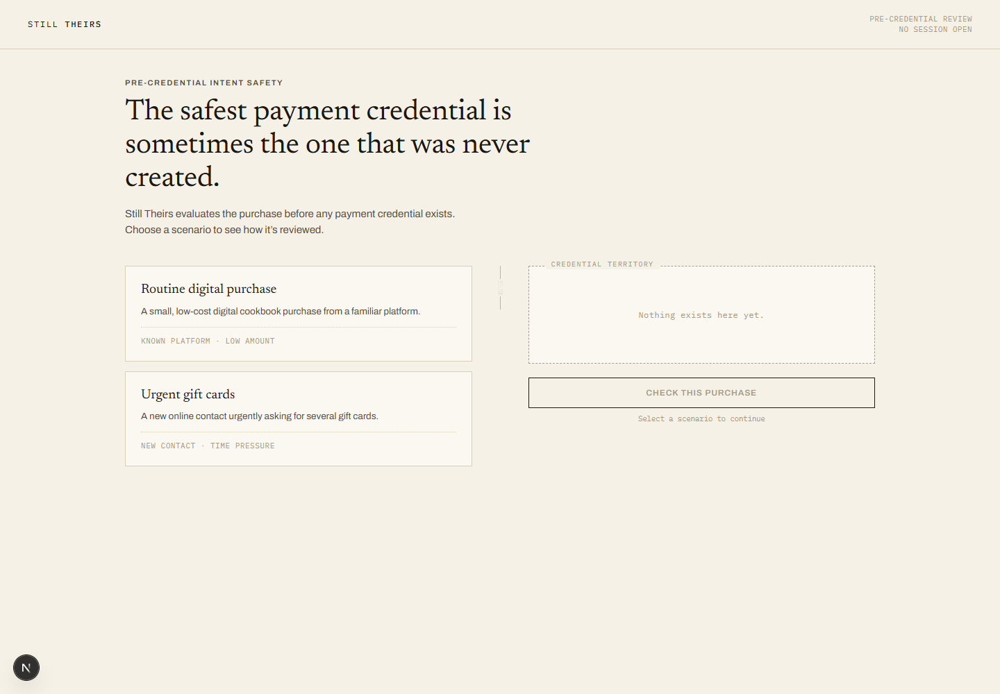
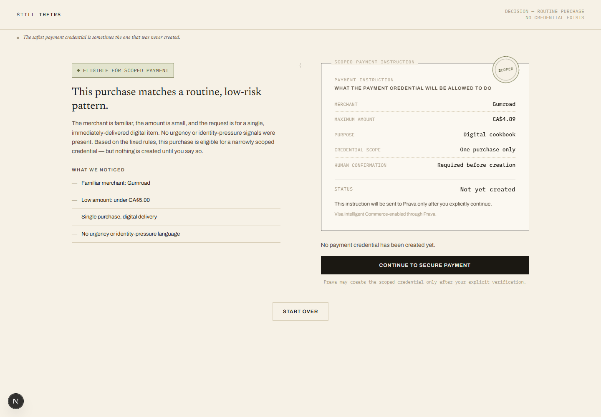
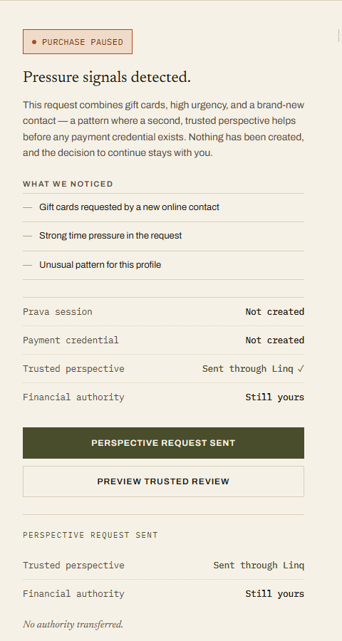
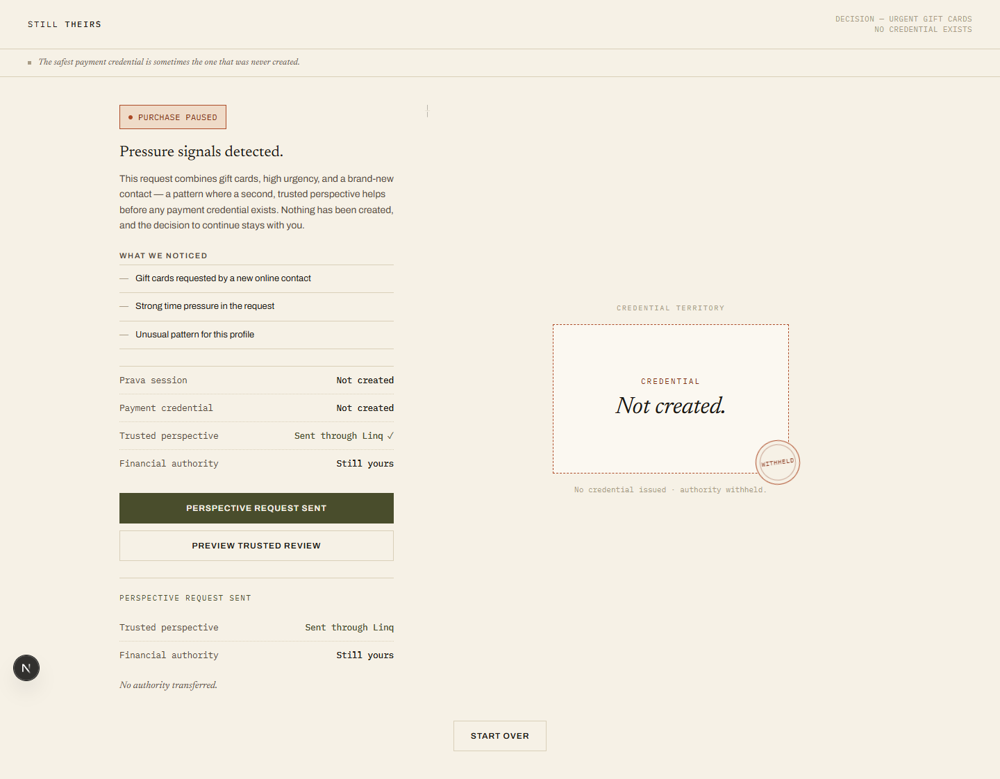
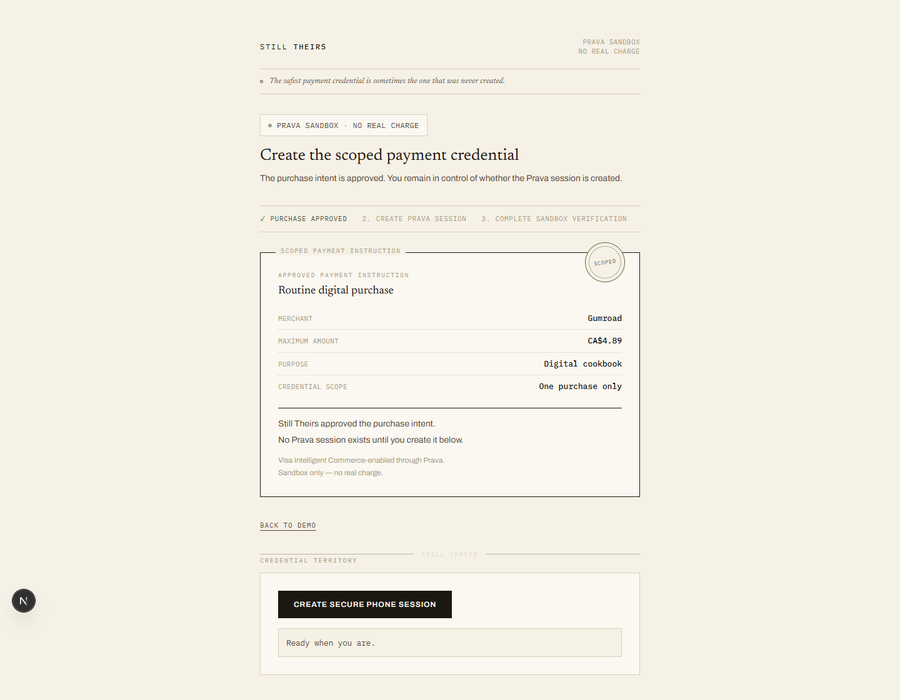

# Still Theirs

Pre-credential intent safety for AI commerce.

> The safest payment credential is sometimes the one that was never created.

**Links**

- Live product — https://still-theirs-live.netlify.app/
- Guided demo — https://still-theirs-live.netlify.app/demo
- GitHub — https://github.com/Faadil1/still-theirs
- Demo video — TODO until URL exists
- Devfolio submission — TODO until URL exists

---

## The problem

Agentic commerce is converging on a good idea: give an AI agent a *scoped* credential — one merchant, one amount, one purchase — so that even a misbehaving agent can only do bounded damage. But every scoped credential still begins with a human decision to create payment authority, and that moment is exactly where pressure scams operate. A person being rushed by a stranger into buying gift cards doesn't need a better-scoped credential; they need a system that notices the pressure *before* any credential exists.

**Most payment safeguards limit what an authorized agent may do. Still Theirs decides whether payment authority should be created at all.**

## The hero moment

**Routine:** Intent approved → explicit continuation → scoped Prava credential.

**Risky:** Pressure detected → purchase paused → Linq perspective request → credential not created.

The risky outcome is the product's signature object — the Missing Card: a dashed card-shaped outline, the exact 1.586:1 silhouette of the credential that was never issued, stamped **Withheld**.



## How it works

1. **Receive structured purchase intent.** A sanitized, structured description of the purchase (merchant familiarity, amount, urgency level, gift-card flag, coercive-language flag, …) is posted once to `/api/risk/analyze`.
2. **Apply deterministic safety rules.** A pure function ([`src/lib/risk/rules.ts`](src/lib/risk/rules.ts)) scores the intent against fixed rules and owns the decision: `APPROVE` or `REQUEST_TRUSTED_CONTACT`. Nothing downstream can change it.
3. **Use OpenAI to explain the result.** The OpenAI Responses API (Structured Outputs, Zod-validated) drafts a plain-language explanation of the decision the rules already made. If the explanation disagrees with or fails to acknowledge the deterministic decision, it is discarded in favor of a deterministic fallback — the decision never moves.
4. **Either allow explicit continuation to Prava, or hold the boundary.** On `APPROVE`, the user sees the exact scoped payment instruction and may *explicitly* continue to `/gate-a2`, where a Prava sandbox session can be created only by another explicit click. On `REQUEST_TRUSTED_CONTACT`, the purchase pauses, no Prava code path is reachable, and the user may send a real trusted-perspective request through Linq (iMessage) — which transfers no financial authority.

## The decision boundary



## Product walkthrough

### Selection

Two scenarios with neutral context tags — no outcome is disclosed before analysis runs. The credential territory on the right of the Held Line reads only "Nothing exists here yet."



### Analysis

Four real stages (intent received, deterministic rules, OpenAI explanation, decision ready). The credential territory stays static the whole time; the **Held** seal settles only when the decision is genuinely ready.

### Approved / scoped payment

The scoped payment instruction (merchant, maximum amount, purpose, one-purchase-only scope, human confirmation required) resolves in with the **Scoped** seal. Status: *Not yet created* — the screen itself creates nothing.



### Risky / the Missing Card

Pressure signals pause the purchase. The right of the Held Line shows the Missing Card — "Credential / Not created." — with the **Withheld** seal. The proof record reads: Prava session *Not created* · Payment credential *Not created* · Financial authority *Still yours*.



### Linq acknowledgement

Sending a perspective request updates only the human side: an acknowledgement tick, and an additive "Perspective request sent … No authority transferred." block. The verdict and the Missing Card do not change — asking a trusted person for their read does not change whether a credential exists.



### Gate A2

The approved instruction travels to `/gate-a2` as display context only. No Prava session exists until the user explicitly clicks "Create secure phone session"; phone-only mode never mounts the Prava SDK on the desktop.



## Why this is different

Mandates and scoped credentials control what happens **after** authority is granted. Still Theirs decides whether authority should be requested **before** credential creation. The two compose: Still Theirs is the gate in front of scoped-credential systems, not a replacement for them.

## Integrations

| Integration | Role | Authority boundary |
|---|---|---|
| Prava | Verification and scoped credential generation | Called only after explicit continuation |
| OpenAI | Plain-language explanation | Cannot change the deterministic decision |
| Linq | Trusted-perspective request through iMessage | Transfers no financial authority |
| Visa Intelligent Commerce | Enabled through Prava where available | No direct Visa API integration |

## Evidence

Full ledger: [docs/EVIDENCE_LEDGER.md](docs/EVIDENCE_LEDGER.md) (E001–E037). Status labels: **VERIFIED** = confirmed against code, tests, or committed records in this repo; **DEMONSTRATED** = live run recorded in the evidence ledger, including user-observed confirmations; **NOT YET IMPLEMENTED** = future work, no claim made.

| Claim | Status | Evidence |
|---|---|---|
| Deterministic rules own both decisions (`APPROVE` / `REQUEST_TRUSTED_CONTACT`) | VERIFIED | [`src/lib/risk/rules.ts`](src/lib/risk/rules.ts), `rules.test.ts`, ledger E027/E028 |
| Live OpenAI explanation on both scenarios (Structured Outputs, schema-valid, decision unchanged) | DEMONSTRATED | Ledger E027, E028, E037 |
| Prava PHONE_ONLY sandbox verification completed and a sandbox payment credential was generated | DEMONSTRATED | Ledger E033 (that session used the earlier US$45.00 grocery-demo values; see limitation below) |
| Prava session request is merchant- and amount-scoped to Gumroad / CA$4.89 | VERIFIED | [`src/lib/prava/server.ts`](src/lib/prava/server.ts) — credential generation under these exact values: TODO (planned E039 controlled run) |
| Real Linq perspective request delivered as iMessage (HTTP 201, from the real UI path) | DEMONSTRATED | Ledger E035 (transport), E037 (integrated `/demo` → route → Linq run) |
| Risky path creates no Prava session and no credential | VERIFIED | Route code + `moduleBoundary` static scans + ledger E037 audit events (`risk.prava.not_created`, no `prava.session.created`) |
| Test suite | VERIFIED | 245 tests / 31 files passing (`npx vitest run`) |
| Lint, typecheck, production build | VERIFIED | `npm run lint`, `npx tsc --noEmit`, `npm run build` all clean |
| Controlled Gumroad merchant checkout (E039) | NOT YET IMPLEMENTED | Prepared values only — no checkout attempt has been made |

## Security and privacy

- All secrets (`PRAVA_SECRET_KEY`, `OPENAI_API_KEY`, `LINQ_API_KEY`, …) are server-side only; `.env.local` is git-ignored. See [docs/SECURITY_NOTES.md](docs/SECURITY_NOTES.md).
- No credential data is ever rendered: `sessionToken` and the one-time iframe URL never appear in JSX, logs, or the audit trail (enforced by static-regression tests).
- No PAN, CVV, or expiry is stored, logged, or fixture-coded anywhere in the repo (test-enforced).
- No session is created on render — `/api/prava/session` is reachable from exactly one explicit user click, never a mount effect (test-enforced).
- Explicit human action is required at every authority step: continue to Gate A2, create the session, complete phone verification.
- The real Linq send is a separate, server-revalidated path; the local "Preview trusted review" is a clearly labeled local simulation that sends nothing.
- The deterministic decision cannot be overridden by the explanatory AI — a mismatched explanation is discarded, never obeyed.
- Audit events store suffixes and booleans only (e.g. `sessionIdSuffix`, `chatIdPresent`), never full identifiers, keys, or raw responses.

## Current limitations

1. The current gate evaluates **structured** pressure signals.
2. Extracting those signals from unrestricted natural-language purchase intents is an upstream capability and is **not implemented** in this prototype.
3. A Linq reply does **not yet return** into the application — delivery is real, ingestion of the trusted contact's answer is future work.
4. Merchant checkout execution remains the **next implementation step** (planned as evidence entry E039; not yet performed).
5. The demonstrated payment evidence covers **sandbox verification and scoped credential generation**, not capture, authorization, clearing, or settlement. The recorded credential-generation run (E033) used the earlier US$45.00 grocery-demo session values; the current Gumroad / CA$4.89 scoping is implemented in code but has not yet had a recorded credential-generation run.

## Technology

Next.js 16 (App Router, Turbopack) · React 19 · TypeScript 5 · `@prava-sdk/core` · OpenAI SDK (Responses API + Structured Outputs) · Linq Partner API (server-side `fetch`) · Zod 4 · `qrcode` · Vitest 4 · Tailwind CSS 4

## Run locally

**Prerequisites:** Node.js 20+ and npm.

```bash
npm install
```

Create `.env.local` (names only — never commit values):

```
PRAVA_BASE_URL=
PRAVA_SECRET_KEY=
NEXT_PUBLIC_PRAVA_PUBLISHABLE_KEY=
PRAVA_TEST_USER_EMAIL=
PRAVA_TEST_USER_ID=
OPENAI_API_KEY=
OPENAI_MODEL=
OPENAI_TIMEOUT_MS=
LINQ_API_KEY=
LINQ_FROM_NUMBER=
LINQ_TRUSTED_CONTACT_NUMBER=
```

```bash
npm run dev        # development server
npx vitest run     # tests
npm run lint       # lint
npx tsc --noEmit   # typecheck
npm run build      # production build
```

## Built during the hackathon

The repository's full history spans the hackathon window: the first commit ("Initial commit from Create Next App", 2026-08-01) is the standard `create-next-app` boilerplate, and all 46 commits after it were made on 2026-08-01 and 2026-08-02. Everything product-specific was built during the event: the deterministic risk engine and sanitized schemas, the OpenAI explanation layer with structured-output validation and fallback, the Prava sandbox integration (health, session creation, desktop-embedded and phone-only Gate A2 with QR transfer), the Linq trusted-perspective provider and API route, the reusable pre-credential safety SDK (`src/sdk/`), the audit/evidence discipline (`docs/EVIDENCE_LEDGER.md`, E001–E037), the full test suite, and the Missing Card product experience. No pre-existing application code predates the event.

## Roadmap

1. **Unrestricted intent-to-signal extraction** — derive the structured pressure signals from free-text purchase intents, so the gate can sit in front of real agent conversations.
2. **Linq reply ingestion** — return the trusted contact's perspective into the product (perspective authority only, never payment authority).
3. **Completed controlled merchant checkout** — one controlled sandbox checkout attempt at Gumroad using the scoped credential (planned evidence entry E039).

---

The credential Still Theirs is most proud of is the one it correctly chose not to create.
