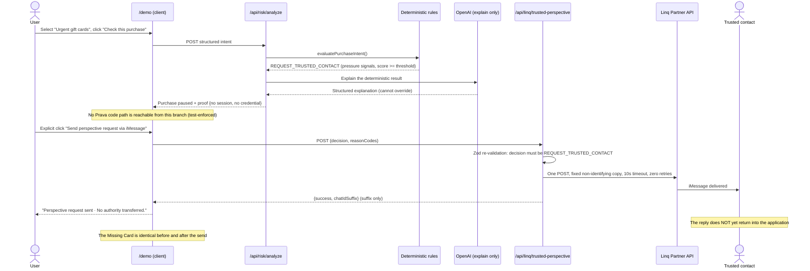

# Still Theirs — Architecture

Pre-credential intent safety for AI commerce. This document describes the system as actually implemented at the current commit; anything not implemented is explicitly labeled.

## 1. System overview

Still Theirs sits **in front of** payment-credential creation. Its core boundary:

```
HUMAN INTENT
  → deterministic intent-safety decision
  → explanation
  → explicit human action
  → PAYMENT AUTHORITY
```

Components:

- **`/demo`** (client) — the product flow: scenario selection → staged analysis → decision (approved or risky). Structurally contains no Prava code path (enforced by static-scan tests).
- **`/api/risk/analyze`** — validates the structured purchase intent (Zod), runs the deterministic engine, then requests an explanation. Never calls Prava, for either decision.
- **`src/lib/risk/rules.ts`** — the pure deterministic rule engine; the only source of the decision.
- **`src/lib/risk/openaiExplanation.ts`** — explain-only OpenAI layer (Responses API, Structured Outputs, Zod-validated, bounded timeout, zero retries, deterministic fallback).
- **`/gate-a2`** (client) + **`/api/prava/session`** — the only path to payment authority. Session creation requires an explicit click; PHONE_ONLY mode transfers the one-time session to a phone via QR and never mounts the Prava SDK on the desktop.
- **`/api/linq/trusted-perspective`** + **`src/lib/linq/server.ts`** — the risky path's human escalation: one server-revalidated, single-flight, zero-retry Linq Partner API call delivering a fixed, non-identifying iMessage.
- **`src/sdk/`** — a thin, framework-agnostic SDK exposing the deterministic engine (`evaluatePurchase()`) to external callers; never imports Prava or OpenAI at module load.
- **`src/lib/audit.ts`** + `data/audit-log.json` — append-only audit events with suffix/boolean fields only; transferred into `docs/EVIDENCE_LEDGER.md` entries and reset.

## 2. Routine path (sequence)

```mermaid
sequenceDiagram
  actor U as User
  participant D as /demo (client)
  participant R as /api/risk/analyze
  participant DR as Deterministic rules
  participant O as OpenAI (explain only)
  participant G as /gate-a2 (client)
  participant PS as /api/prava/session
  participant P as Prava sandbox

  U->>D: Select "Routine digital purchase", click "Check this purchase"
  D->>R: POST structured intent (exactly once, single-flight)
  R->>DR: evaluatePurchaseIntent()
  DR-->>R: APPROVE + reason codes (decision owned here)
  R->>O: Explain the deterministic result
  O-->>R: Structured explanation (validated; cannot change the decision)
  R-->>D: decision + explanation + proof {no session, no credential}
  U->>D: Explicit click "Continue to secure payment"
  D->>G: Plain navigation to /gate-a2?mode=phone&source=demo
  U->>G: Explicit click "Create secure phone session"
  G->>PS: POST (the only trigger for session creation)
  PS->>P: Create session (merchant Gumroad, max CA$4.89, one purchase)
  P-->>PS: Session (token never rendered or logged)
  G-->>U: QR code (one-time URL drawn to canvas only)
  U->>P: Phone opens the one-time URL, completes sandbox OTP
  P-->>U: Verification result + scoped sandbox credential
  Note over P: Merchant checkout — NOT YET PERFORMED (planned E039)
```

## 3. Risky path (sequence)



## 4. Authority matrix

Every cell verified against the implementation (routes, static-scan tests, and `docs/EVIDENCE_LEDGER.md`).

| Actor / system | Can explain | Can request perspective | Can create payment authority | Can spend |
|---|---|---|---|---|
| User | Yes (sees full explanation) | Yes (explicit click) | Only through explicit verified continuation (two clicks + phone OTP) | Through the approved flow only — merchant checkout not yet performed |
| Deterministic engine | Produces reason codes | Chooses the safe branch | No | No |
| OpenAI | Yes | No | No | No |
| Trusted contact | Shares perspective | Replies externally (not yet ingested) | No | No |
| Linq | Delivers the message | Yes (as transport) | No | No |
| Prava | No | No | After explicit verified continuation | Provides the scoped credential; does not spend it |

## 5. Deterministic-rule responsibility

`evaluatePurchaseIntent()` (`src/lib/risk/rules.ts`) is a pure function over the sanitized `PurchaseIntent`: additive scores for gift-card request (+40), high urgency (+20), unfamiliar recipient (+20), unusual payment instruction (+20), coercive language (+30), unusual-for-profile (+15), with a `MULTIPLE_RISK_SIGNALS` code at 3+ signals. Score ≥ 40 → `REQUEST_TRUSTED_CONTACT`; otherwise `APPROVE`. It alone sets `safeToCreatePravaSession` and `credentialCreationAllowed` (both strictly `decision === "APPROVE"`). Nothing downstream — OpenAI, Linq, UI state, the SDK's `merchantContext` extension point — can modify the decision (test-enforced, including a reflection scan of the demo controller for credential-creating methods).

## 6. OpenAI responsibility and limitations

- Receives only a **sanitized feature payload** (no free text, no `userStatement`, no identity or card data — see `buildSanitizedPayload()` in `src/lib/risk/openaiExplanation.ts`).
- Called via the Responses API with **Structured Outputs** and a Zod schema; bounded timeout (`OPENAI_TIMEOUT_MS`, default 30s), `maxRetries: 0`.
- Must acknowledge the deterministic decision; a mismatch or invalid schema discards the explanation in favor of a **deterministic fallback** — the decision never changes (`DECISION_MISMATCH` handling, test-enforced).
- Failure categories are sanitized enums; raw error text is never forwarded.
- **Limitation:** OpenAI does not extract signals from free text — the intent is already structured when it arrives. Free-text extraction is future work.

## 7. Prava responsibility

- Health check, session creation, and (implemented but not yet exercised by any route) payment-result and report-status clients live in `src/lib/prava/server.ts`, server-only.
- The session request is merchant- and amount-scoped: Gumroad, `total_amount: "4.89"` CAD, one product, `external_order_ref` per session.
- `/api/prava/session` is reachable from exactly one explicit user click on `/gate-a2`; never from a mount effect, never from `/demo`, never from the risky branch (all test-enforced).
- `PHONE_ONLY` mode structurally never instantiates `PravaSDK` or calls `collectPAN()` on the desktop; the one-time iframe URL's only desktop use is as QR-encoder input (static-scan-enforced).
- Demonstrated live: PHONE_ONLY verification with sandbox credential generation (ledger E033 — run under the earlier US$45.00 grocery-demo session values; a run under the current Gumroad/CA$4.89 values is pending, planned as E039).
- Visa: no direct Visa API integration — Prava supports Visa Intelligent Commerce where available.

## 8. Linq responsibility

- One server-side `fetch` to the Linq Partner API per explicit user click; single-flight guard (concurrent second call → HTTP 429 without reaching `fetch`), 10s timeout, zero retries, fresh idempotency key.
- The route's Zod schema requires `decision === "REQUEST_TRUSTED_CONTACT"` — an APPROVE body fails with HTTP 400 before the provider is constructed, making Linq structurally unreachable from the approved path.
- The outgoing message is a fixed, non-templated string: no merchant name, amount, links, or personal data (test-enforced).
- The response returns only `{success, provider, deliveryRequested, chatIdSuffix?, statusCategory?}` — nothing Linq returns has any path back into the deterministic result.
- Demonstrated live: HTTP 201 with real iMessage delivery, from the actual UI path (ledger E035, E037).
- **Limitation:** delivery only — the trusted contact's reply is not yet ingested.

## 9. Data and secret boundaries

- **Server-only secrets:** `PRAVA_SECRET_KEY`, `OPENAI_API_KEY`, `OPENAI_MODEL`, `LINQ_API_KEY`, `LINQ_FROM_NUMBER`, `LINQ_TRUSTED_CONTACT_NUMBER` — read via Zod-validated accessors in `src/lib/env.ts`, never in client bundles. The only browser-exposed credential is `NEXT_PUBLIC_PRAVA_PUBLISHABLE_KEY` (by Prava's design).
- **Never rendered/logged:** `sessionToken`, one-time iframe URLs, PAN/CVV/expiry/OTP (no fixtures either), full session/order/chat IDs, raw upstream response bodies.
- **Redaction:** all Prava error objects pass through a recursive redaction helper (`src/lib/prava/redact.ts`) before being written anywhere.
- **Audit log:** append-only, best-effort (never blocks the product), suffix/boolean fields only; inspected, transferred to the evidence ledger, then reset.
- **What is sent to OpenAI:** the sanitized feature payload only. **What is sent to Linq:** the fixed perspective-request copy only.

## 10. Implemented vs future capabilities

| Capability | Status |
|---|---|
| Structured purchase-intent schema + deterministic decision engine | Implemented, live-validated (E027/E028) |
| OpenAI structured explanation with fallback and decision-mismatch discard | Implemented, live-validated (E027/E028/E037) |
| `/demo` product flow (Selection → Analysis → Approved / Risky, Missing Card experience) | Implemented, test-covered |
| Gate A2 DESKTOP_EMBEDDED mode (embedded `collectPAN`) | Implemented, live-exercised (E032) |
| Gate A2 PHONE_ONLY mode with QR transfer, credential generation | Implemented, live-validated (E033) |
| Merchant- and amount-scoped session request (Gumroad / CA$4.89) | Implemented in code; no recorded credential run under these exact values yet |
| Linq trusted-perspective send (real iMessage) | Implemented, live-validated (E035/E037) |
| Reusable pre-credential safety SDK (`src/sdk/`) | Implemented, test-covered (E034) |
| Audit events + evidence ledger discipline | Implemented (E001–E037) |
| Free-text (natural-language) intent-to-signal extraction | NOT YET IMPLEMENTED |
| Linq reply ingestion (perspective returning into the app) | NOT YET IMPLEMENTED |
| Controlled Gumroad merchant checkout (payment-result / report-status exercised) | NOT YET IMPLEMENTED (clients exist in `src/lib/prava/server.ts`, unused by any route; planned E039) |
| Capture, authorization, clearing, settlement | NOT CLAIMED, out of scope |
